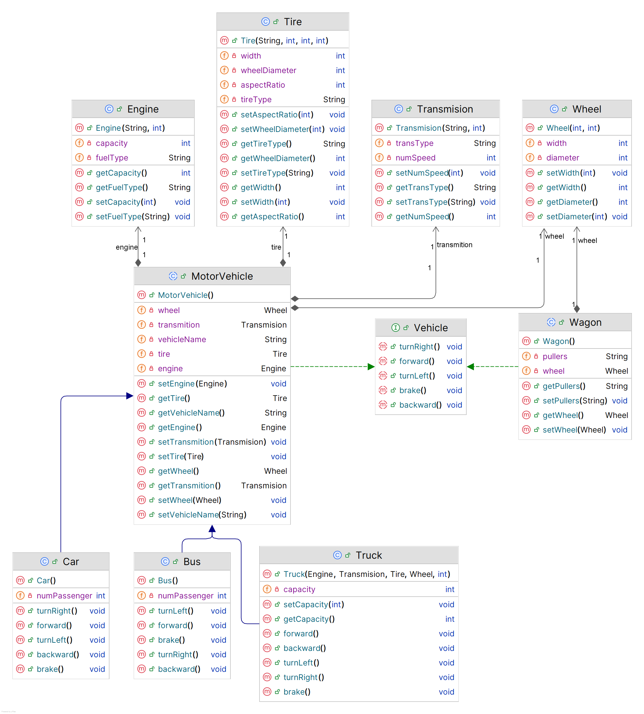

# Soal Interface, Polymorphism & relasi antar kelas
Kamu diminta untuk membuat Applikasi yang sesuai dengan Class Diagram yang diberikan.
  

### Poin Penilaian (max 100 point):
1. Eksekusi perintah mvn test -Dtest="CompleteTest" untuk mengetahui nilai Anda