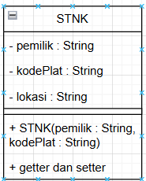
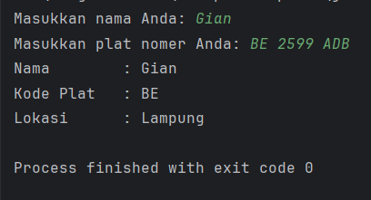
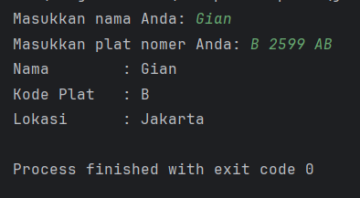

<h1 style="text-align: center;">Minggu 2: Perkenalan PBO</h1>

    

        <h2>Class</h2>
        
    

Kalian akan diberikan 2 buah class: Main dan STNK.

- STNK

    Lengkapilah class STNK. Class ini mempunyai komponen - komponen yang bisa dilihat di diagram di atas.  
    Buat juga sebuah konstruktor STNK yang menerima parameter: 

    - pemilik : String 
    - kodePlat : String 
    - lokasi : String 
    
    untuk properti <b>lokasi</b> pada class STNK, kalian isi sendiri sesuai dengan kode pada parameter kodePlat yang diberikan pada konstruktor. 
    Biar lebih mudah:
    - BE = Lampung
    - AB = Jogja
    - D = Bandung
    - B = Jakarta
    Buat juga getter setternya.

- Main
    Untuk kelas ini, tujuan utama kalian adalah menerima input dari user berupa nama dan plat nomer. Tenang saja, sudah disediakan oleh admin. Kemudian, dari data tersebut, buatlah sebuah objek STNK. Kemudian, masukkan objek tersebut ke dalam fungsi printSTNK yang sudah disediakan oleh admin. 

## OUTPUT

