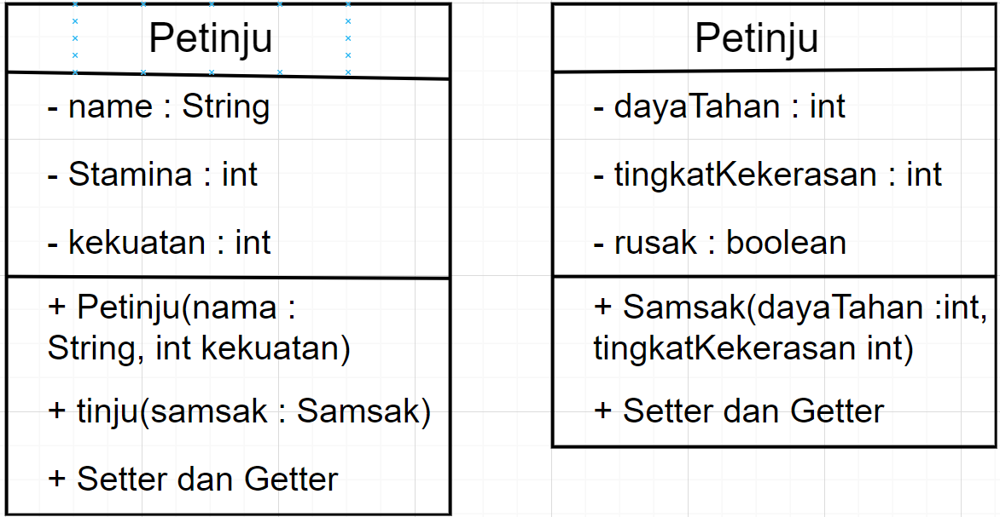
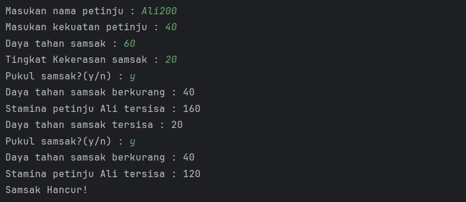
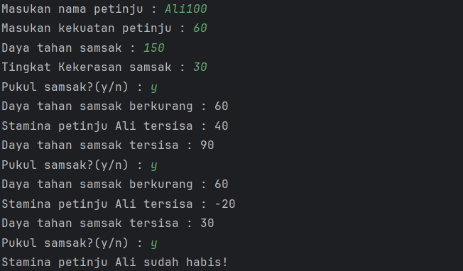
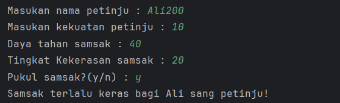

<h1 style="text-align: center;">Minggu 3: Enkapsulasi dan Konstruktor</h1>

    

        <h2>Class</h2>
        
    

Kalian akan diberikan 3 buah class: Main, Petinju, dan Samsak.

- Petinju

  Lengkapilah class Petinju. Class ini mempunyai komponen - komponen yang bisa dilihat di diagram di atas.  
   
  Buat sebuah konstruktor Petinju yang menerima parameter :
    - name : String
    - kekuatan : int

  Properti <b>nama</b> pada class Petinju memiliki inputan gabungan antara nama dan stamina yang digabung dalam sebuah string, contohnya "Paquito200" dengan nama "Paquito" dan stamina "200"
   
   
  Method <b>tinju</b> menerima parameter :
    - samsak : Samsak

  Method ini nantinya akan digunakan untuk melakukan tinju kepada object samsak yang telah dibuat, namun perlu diperhatikan tinju pada samsak dilakukan dengan syarat petinju harus memiliki stamina yang cukup untuk melakukan tinjuan, setelah melakukan tinjuan kepada samsak, maka stamina petinju akan berkurang sebanyak kekuatan yang dikeluarkan untuk meninju, kekuatan petinju juga harus lebih dari tingkat kekerasan samsak untuk dapat memberikan sejumlah kerusakan, dan ketika daya tahan samsak sudah habis maka status samsak dinyatakan rusak.
  Buatlah juga getter dan setternya juga.
   
   
- Samsak

  Lengkapilah class Samsak. Class ini mempunyai komponen - komponen yang bisa dilihat di diagram di atas.  
   
  Buat sebuah konstruktor Ternak yang menerima parameter :
    - dayaTahan : int
    - tingkatKerusakan : int
    - rusak : boolean

   
  Buatlah juga getter dan setternya juga.
   
   
- Main
  Untuk kelas ini, tujuan utama kalian adalah membuat object yang dibutuhkan, kemudian tinggal memanggil fungsi tinju yang telah dibuat untuk memulai program

## OUTPUT
Output berhasil meninju hingga samsak hancur
 

 
Contoh output ketika stamina petinju habis
 

 
Contoh output ketika samsak yang dipukul terlalu keras
 

